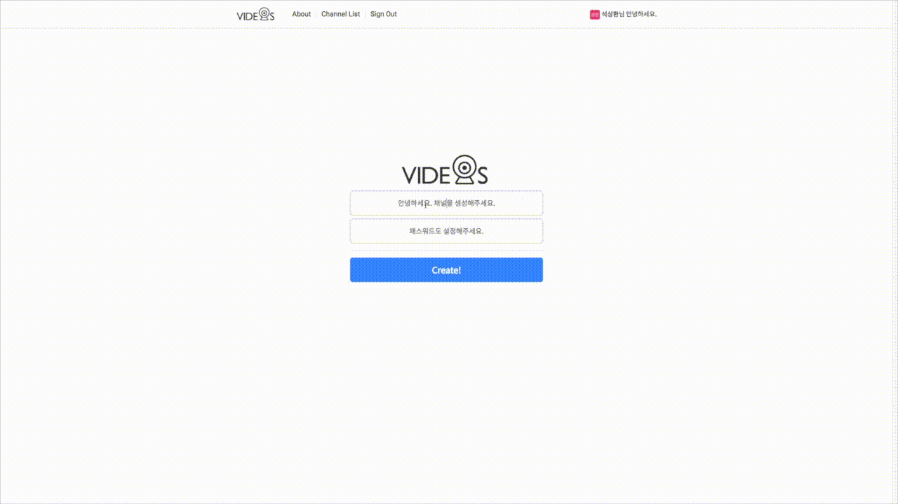
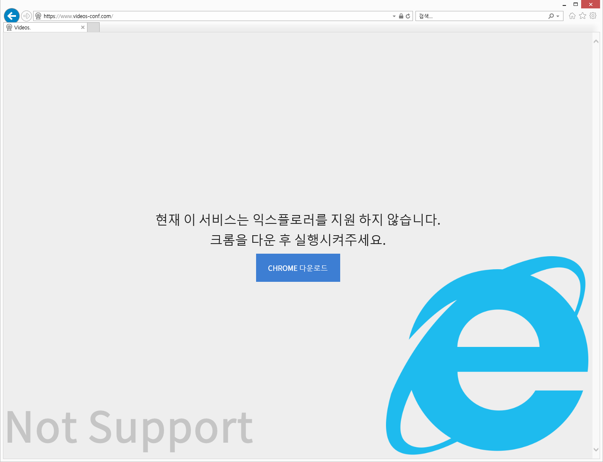
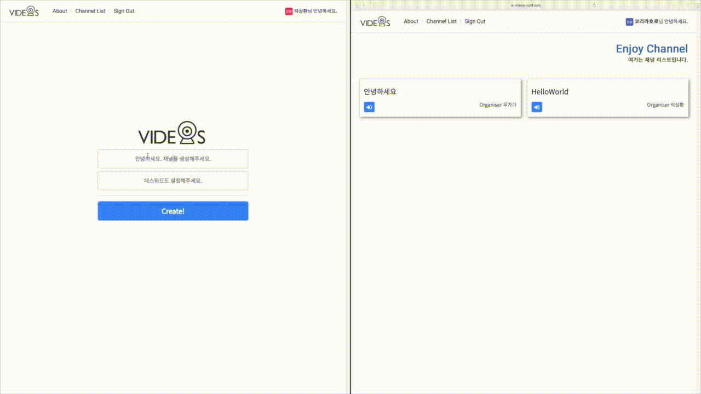

# [Videos.](http://videos-conf.com/)



## Introduction
Videos는 연결된 웹켐으로 채널을 생성하여 간편하게 여러명과 동시에 화상채팅을 할 수 있는 서비스입니다. 

## Period
2018년 10월 11일 ~ 10월 28일

## Prerequisites
- Chrome Browser를 권장 합니다.
- IE에 대한 대책은 페이지를 크롬설치를 권장하게끔 페이지를 따로 만들었습니다.



## Installation
```
git clone https://github.com/seoksanghwan/videosConf-server.git
npm
npm install
npm nodestart

yarn
yarn install
yarn nodestart
```

## Feature
- 로그인은 Firebase Auth를 이용하였습니다(google id로 로그인)
- 메인페이지에서 채널을 생성 할 수 있습니다
- 채널 생성시 제목은 공백만으로는 제목을 작성 할 수 없습니다.
- 채널 생성시 패스워드 6글자 이상 16글자 이하로 숫자, 문자, 특수문자 조합으로 이루어져야합니다.
- 로그인이 되어있지 않으면 방 생성 및 채널리스트에 접근 할 수 없게 메시지가 뜨며, 주소창으로 접근 할 시, 메인으로 이동하게 하였습니다.
- 채널을 생성 후 채널 리스테에 들어가면 삭제 버튼은 주최자만 확인 가능 합니다.
- 화상회의 도중 주최자가 방을 나가 삭제 할 경우 화상회의 채널에 있던 사람들은 자동적으로 방에서 나가지면 warning페이지를 거쳐 리스트로 갑니다.
- about페이지에서 채널을 검색을하여, 있는 채널이면 비밀번호를 입력하고 들어 갈 수 있습니다. 없는 채널이면 경고문이 표시됩니다.
- 채널에 없는 제목을 주소창에 입력하게 되면 잘못된 접근이라는 warning페이지를 이동하게끔 설정 하였습니다.
- 채널에 있는 페이지일 경우 패스워드를 입력을 하지 않고, 주소창으로 접근을하게되면, warning페이지를 이동하게끔 설정 하였습니다.
- 참여한 채널에서 mute를 클릭하게되면 상대방에게 소리가 전달이 안됩니다. 
- 참여한 채널에서 unmute를 클릭하게되면 상대방에게 소리가 전달이 됩니다. 
- 채널은 실시간으로 생성, 삭제가 방영됩니다.


## Tech Stack
- 자바스크립트(ES2015+)를 기본으로 제작하였습니다.
- Redux를 사용하여 state관리를 제 나름대로 체계적으로 해봤습니다.
- React, Webpack, CSS을 사용한 컴포넌트 베이스 UI 아키텍처를 구현하였습니다.
- Socket.io를 활용하여 실시간 업데이트 및 삭제를 구현하였습니다.
- JWT를 사용하여 로그인정보를 해쉬처리하였습니다.
- 채널 비밀번호 생성시 비밀번호는 보안을 위하여 pbkdf2이용하여 해쉬처리를 하였습니다.
- 서버는 node.js, express, mongoose를 사용하여 구현 하였습니다.
- liowebRtc라는 webrtc기반에 라이브러리를 사용하여, 화상회의 기능을 구현 하였습니다.

### Client-Side Specification

- ES2015
- React
- Redux
- React Router
- Firebase Authentication
- Sokcet.io-client
- lioWebRtc

### Server-Side Specification

- Node.js
- Express
- JSON Web Token Authentication
- MongoDB, mlab
- socket.io
- Heroku를 통한 배포

## Deployment
- client는 netlify를 이용하여 github repository를 배포하였습니다.
- server는 heroku를 이용하여 배포 하였습니다.

## Version Control
- Client, Server의 GIT Repoitory를 구분하여 독립적인 관리를 하였습니다.

## Planning
- Trello를 이용하여 일정을 관리하여 진행하였습니다. 

## Things to do
2주 동안의 완성을 목표로 좀 더 완성도 높은 결과물을 배출하고 싶어 어정쩡하게 초기 기획을 다 구현하기 보다는 조금 더 완벽하게
뽑아내고 싶은 욕심에 초기 기획에있는 기능 몇 가지 제거하여 완성도를 높였습니다. webrtc및 socket.io에 좀 더 공부하고 싶은 욕심이 생겼습니다.
공부를 더 하여 추가 하고 싶은 기능들에 리스트입니다.

- 인원 수 옵션 추가
- 메일 초대 기능 추가
- 공개 방 비공개방 따론 분류